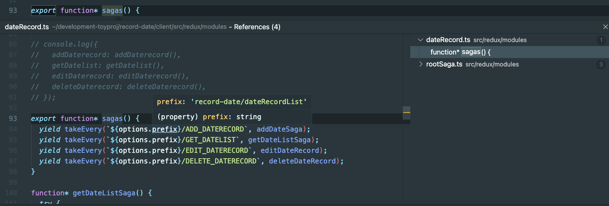
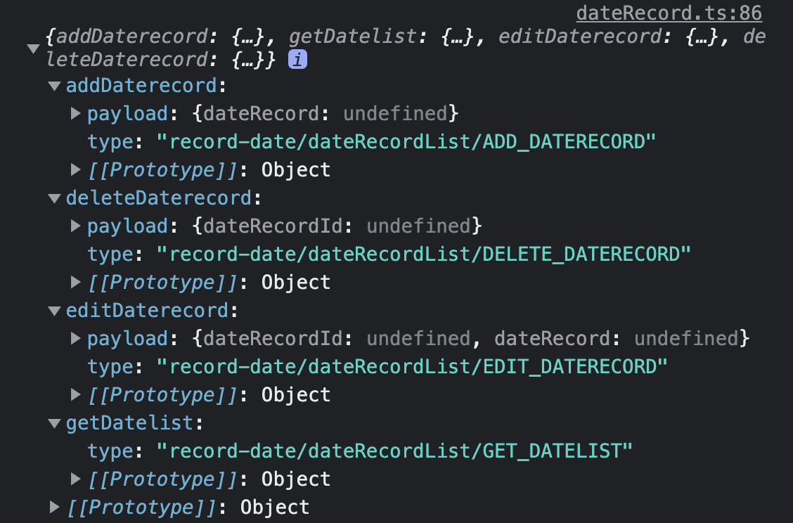
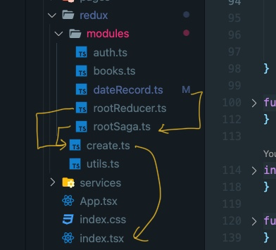

* [ ] redux-saga에서 state관리는 어떻게 되고 있을까? 정리하기
  * 힌트는 rootRecuder.ts에 있다.!

* redux/create.ts -> src/index.tsx
* redux/modules/rootSaga.tsx -> redux/create.ts

* redux/modules/rootState.ts
  * <- redux/modules/dateRecord.ts

* redux/modeuls/dateRecord.ts 설명
  
  * redux-saga 설정
    * sagas() generator함수에서 takeEvery함수(redux-saga함수)의 첫번째, 두번째 인자 값으로 action과 수행할 순수함수를 인자로 받으면서 observing 한다.
    * component에서 createActions 함수를 수행하면 redux-saga가 observing()하면서 등록된 함수를 수행한다.
      * createActions return 값  
      (addDaterecord, getDatelist, deleteDaterecord, editDaterecord)
        * 아래 캡쳐의 type을 보면 sagas generator함수의 takeEvery 첫번째 변수와 같다.
      
  
* 파일구조로본 redux, redux-saga 설정
  
